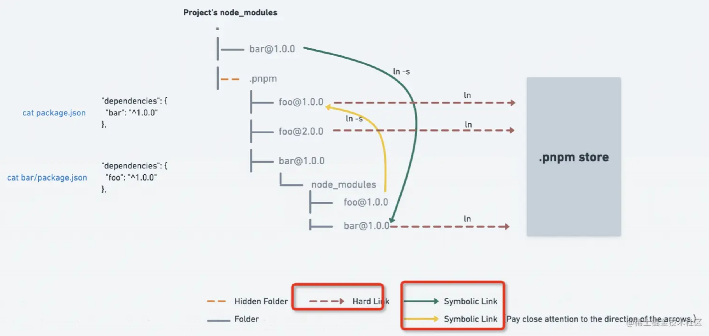
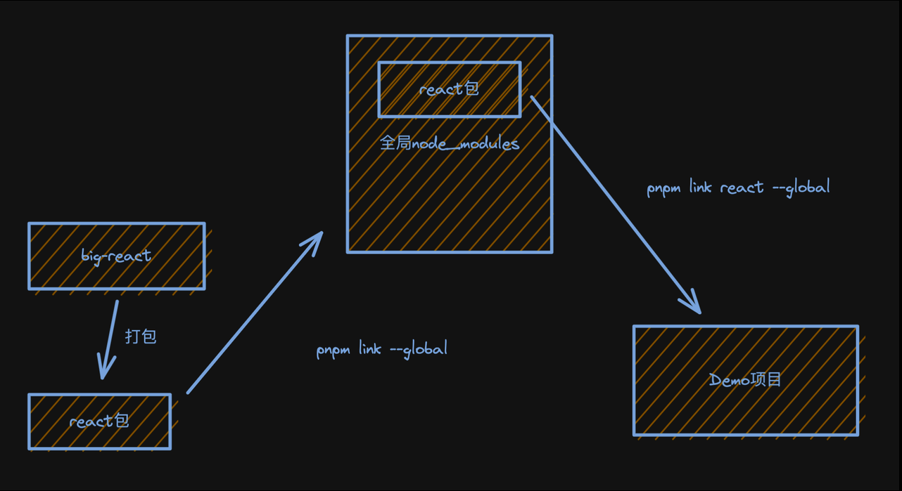
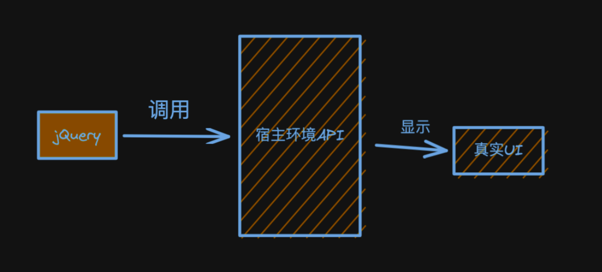
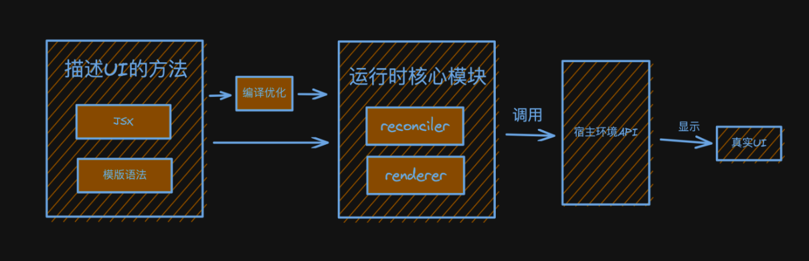
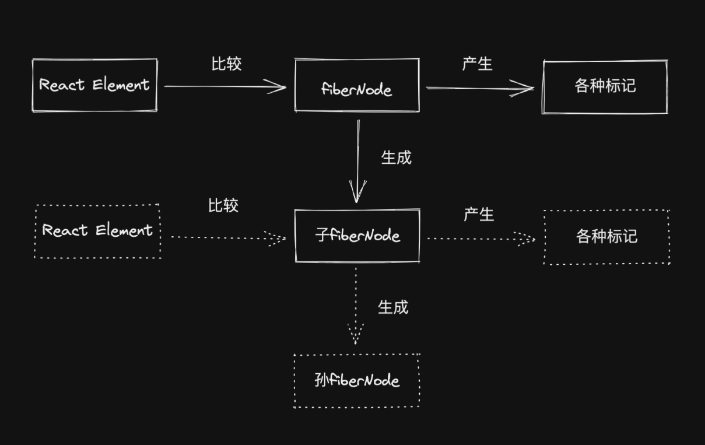
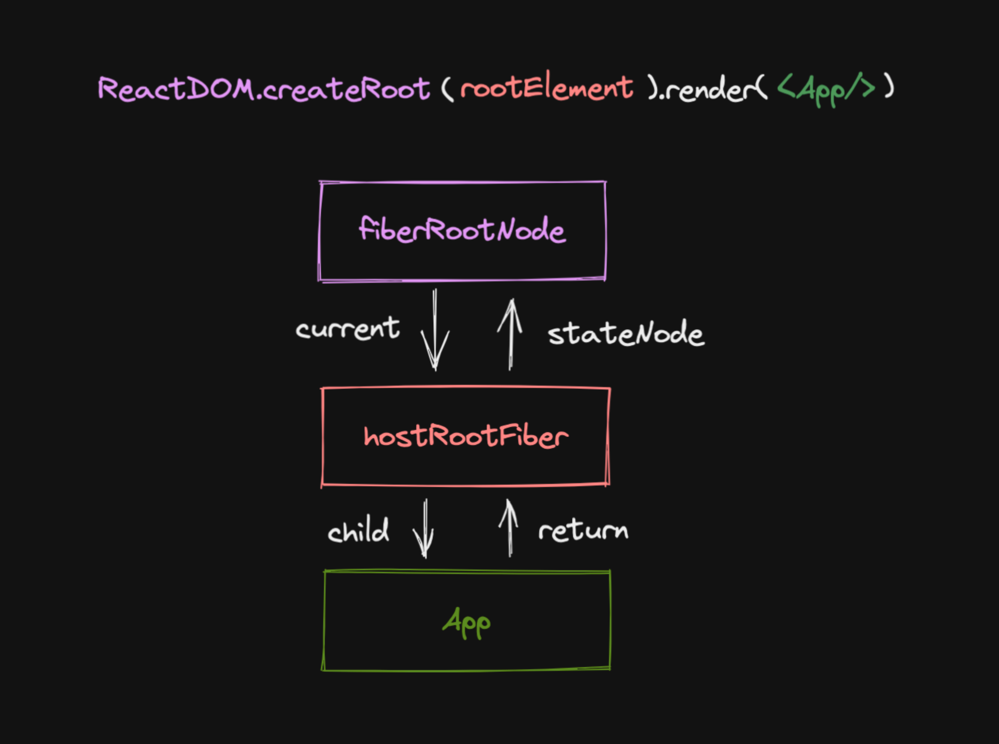

## 1.搭建环境零碎知识

### 1.1 pnpm i xxx -D -w (-D: devDependencies -w: pnpm-workspace根目录)

### 1.2 "parser": "@typescript-eslint/parser", 表示用什么工具将js代码转为抽象语法树(AST语法树)

### 1.3 安装husky，用于拦截commit命令
```zsh
# 安装husky，用于拦截commit命令：
pnpm i husky -D -w

# 初始化husky：
npx husky install

# 将刚才实现的格式化命令pnpm lint纳入commit时husky将执行的脚本：
husky add .husky/pre-commit "pnpm lint"

# 通过commitlint对git提交信息进行检查，首先安装必要的库：
pnpm i commitlint @commitlint/cli @commitlint/config-conventional -D -w

# 建配置文件.commitlintrc.js：
module.exports = {
  extends: ["@commitlint/config-conventional"]
};

# 集成到husky中：
npx husky add .husky/commit-msg "npx --no-install commitlint -e $HUSKY_GIT_PARAMS"
```

conventional规范集意义：<br/>
- feat: 添加新功能
- fix: 修复 Bug
- chore: 一些不影响功能的更改
- docs: 专指文档的修改
- perf: 性能方面的优化
- refactor: 代码重构
- test: 添加一些测试代码等等

### 1.4 tsconfig.json
```
"baseUrl": "./packages" // typescript基础的入口
```

### 1.5 pnpm 是凭什么对 npm 和 yarn 降维打击的（https://juejin.cn/post/7127295203177676837）

<strong>区别</strong>
- npm2 是通过嵌套的方式管理 node_modules 的，会有同样的依赖复制多次的问题。
- npm3+ 和 yarn 是通过铺平的扁平化的方式来管理 node_modules，解决了嵌套方式的部分问题，但是引入了幽灵依赖的问题，并且同名的包只会提升一个版本的，其余的版本依然会复制多次。
- pnpm 则是用了另一种方式，不再是复制了，而是都从全局 store 硬链接（Hard Link）到 node_modules/.pnpm，然后之间通过软链接（Symbolic Link / 软链接）来组织依赖关系。这样不但节省磁盘空间，也没有幽灵依赖问题，安装速度还快，从机制上来说完胜 npm 和 yarn。


<strong>pnpm 中如何用硬链接和软链接？</strong><br/>
pnpm 的核心是<strong>全局存储（Global Store） + 虚拟存储（Virtual Store）</strong>，通过链接实现 “一份包，多处复用”：
- 硬链接：全局 Store → 虚拟 Store<br/>
pnpm 会把下载的包缓存到<strong>全局 Store</strong>（比如~/.pnpm-store），每个版本的包只存一份。当你在项目中安装依赖时，pnpm 不会复制包文件，而是从全局 Store硬链接到项目的node_modules/.pnpm（虚拟 Store）。
  - 作用：全局 Store 里的包和项目虚拟 Store 里的包，本质是同一个文件的不同 “名字”，既节省磁盘空间，又能直接访问文件内容。
- 软链接：虚拟 Store → 项目 node_modules<br/>
项目根目录的node_modules里的包（比如express），其实是软链接到虚拟 Store 里的对应包（node_modules/.pnpm/express@4.18.2/node_modules/express）。<br/>
而虚拟 Store 里的包之间的依赖（比如express依赖body-parser），也是通过软链接指向虚拟 Store 里的body-parser包。
  - 作用：用软链接组织依赖关系，既保证了 “非扁平化”（避免幽灵依赖），又能让包找到自己的依赖，同时不会复制文件。

<strong>总结</strong><br/>
- 硬链接解决 “多项目复用同版本包” 的问题，节省磁盘空间。
- 软链接解决 “依赖关系组织” 的问题，既保证非扁平化（无幽灵依赖），又能让包找到自己的依赖。

### 1.6 pnpm-workspace.yaml
```yaml
packages:
  - 'packages/*'
```
packages: ['packages/*'] 表示：项目根目录下的packages文件夹中，所有直接子目录都被识别为独立的子包（package）。
例如：packages/react、packages/utils、packages/cli 等目录会被视为一个个独立的 npm 包。

## 2.实现JSX

### 2.1 React项目结构：

- react（宿主环境无关的公用方法）
- react-reconciler（协调器的实现，宿主环境无关）
- 各种宿主环境的包
- shared（公用辅助方法，宿主环境无关）

JSX转换属于react包。<strong>(注意：在packages包中创建任何包，都需要进入该包内pnpm init，然后比如react依赖了shared的包，那么在react包下执行 pnpm i)</strong><br/>
比如react包使用了shared包，那么需要将shared包添加到react包中package.json中的dependencies中
```json
{
	"name": "react",
	"version": "1.0.0",
	"description": "react公用方法",
	"module": "index.ts",
	"dependencies": {
		"shared": "workspace:*"
	},
	"keywords": [],
	"author": "",
	"license": "ISC"
}
```
流程<br/>
```zsh
# 创建react
cd packages/ && mkdir react
cd react/
# 初始化 package.json
pnpm init
```
```json
{
  "name": "react",
  "version": "1.0.0",
  "description": "react公用方法",
  // "main": "index.js", // * 本包的入口文件，main对应的是commonjs规范
  "module": "index.ts", // rollup原生支持esm，因此我们不需要上面的commonjs的main，在这里添加module的入口
  "keywords": [],
  "author": "",
  "license": "ISC"
}
```
最后在react包下创建index.ts(入口文件)

### 2.2 JSX转换是什么
<a href="https://babeljs.io/repl#?browsers=defaults&build=&builtIns=false&corejs=3.6&spec=false&loose=false&code_lz=DwEwlgbgfAjATAZmAenNIA&debug=false&forceAllTransforms=false&shippedProposals=false&circleciRepo=&evaluate=false&fileSize=false&timeTravel=false&sourceType=module&lineWrap=true&presets=react%2Cstage-2&prettier=false&targets=&version=7.19.5&externalPlugins=&assumptions=%7B%7D">JSX转换 playground<a/><br/>

<strong>babel将JSX转为了_jsx(...)或React.createElement(...)</strong>
- React17之前将JSX转为了React.createElement(...)
- React17之后将JSX转为了_jsx(...)
```ts
import { jsx as _jsx } from "react/jsx-runtime";

/*#__PURE__*/_jsx("div", {
  children: "123"
});

// 或
/*#__PURE__*/React.createElement("div", null, "123");
```

包括两部分：

- 编译时:
```js
从<div>123</div> 到 _jsx("div", {children: "123"});</code>的过程
```

- 运行时：jsx方法或React.createElement方法的实现（包括dev、prod两个环境）

<strong>编译时由babel编译实现，我们来实现运行时，工作量包括：</strong>

- 实现jsx方法
- 实现打包流程
- 实现调试打包结果的环境

<strong>rollup打包的产物格式 format: "umd", 兼容commonjs和esm</strong>
```js
{
  input: `${pkgPath}/${module}`,
  output: {
    file: `${pkgDistPath}/index.js`,
    name: 'index.js',
    format: 'umd' // umd兼容commonjs和esm
  },
}
```

### 2.3 pnpm link的本地调试方式

这种方式的优点：可以模拟实际项目引用React的情况

缺点：对于我们当前开发big-react来说，略显繁琐。对于开发过程，更期望的是热更新效果。

### 2.4 Symbol 和 Symbol.for
Symbol 是 ES6 引入的基本数据类型，用于创建唯一标识；Symbol.for() 是 Symbol 的静态方法，用于创建 / 获取全局注册表中的共享 Symbol。
- 普通 Symbol
  - 通过 Symbol(key) 创建，每个都是唯一的，即使描述符（key）相同：
  ```js
  const s1 = Symbol('foo');
  const s2 = Symbol('foo');
  console.log(s1 === s2); // false（各自独立）
  ```
  - 作用：避免对象属性名冲突（如作为对象的私有属性键）。

- Symbol.for(key)
  - 在全局 Symbol 注册表中操作：
    - 若注册表中已有 key 对应的 Symbol，直接返回该 Symbol；
    - 若没有，则创建新 Symbol 并注册到全局，后续可通过相同 key 获取。
  - 特点：相同 key 对应同一个 Symbol，可跨模块 / 环境共享：
```js
const s3 = Symbol.for('bar');
const s4 = Symbol.for('bar');
console.log(s3 === s4); // true（全局共享）
```
- 核心区别
###
| 特性                | 普通 Symbol               | Symbol.for()              |
|---------------------|---------------------------|---------------------------|
| 唯一性              | 始终唯一（即使 key 相同）  | 相同 key 对应同一个 Symbol |
| 全局注册表          | 不注册                    | 注册到全局                |
| 跨模块共享          | 不支持                    | 支持                      |

## 3.实现Reconciler架构
reconciler是React核心逻辑所在的模块，中文名叫协调器。协调（reconcile）就是diff算法的意思。

### 3.1 reconciler有什么用？

jQuery工作原理（过程驱动）：



前端框架结构与工作原理（状态驱动）：

- react：reconciler
- vue: renderer



react:
- 消费JSX
- react没有编译优化，vue有编译优化
- 开放通用API供不同宿主环境使用

### 3.2 核心模块消费JSX的过程

核心模块操作的数据结构是？当前已知的数据结构：ReactElement<br/>
ReactElement如果作为核心模块操作的数据结构，存在的问题：
- 无法表达节点之间的关系
- 字段有限，不好拓展（比如：无法表达状态）

所以，需要一种新的数据结构，他的特点：<br/>
- 介于ReactElement与真实UI节点之间
- 能够表达节点之间的关系
- 方便拓展（不仅作为数据存储单元，也能作为工作单元）

这就是FiberNode（虚拟DOM在React中的实现），vue中虚拟DOM叫VNode。

当前我们了解的节点类型：

- JSX
- ReactElement
- FiberNode
- DOMElement

### 3.3 reconciler的工作方式
对于同一个节点，比较其ReactElement与fiberNode，生成子fiberNode。并根据比较的结果生成不同标记（插入、删除、移动......），对应不同宿主环境API的执行。



比如，挂载```<div></div>```

```js
// React Element <div></div>
jsx("div")
// 对应fiberNode
null
// 生成子fiberNode（无）
// 对应标记，插入div
Placement
```

将```<div></div>```更新为```<p></p>```：
```js
// React Element <p></p>
jsx("p")
// 对应fiberNode
FiberNode {type: 'div'}
// 生成子fiberNode（无）
// 对应标记，先删除div，后插入p
Deletion Placement
```

当所有ReactElement比较完后，会生成一棵fiberNode树，一共会存在两棵fiberNode树：

- current：与视图中真实UI对应的fiberNode树
- workInProgress：触发更新后，正在reconciler中计算的fiberNode树

### 3.4 JSX消费的顺序
以DFS（深度优先遍历）的顺序遍历ReactElement，这意味着：

- 如果有子节点，遍历子节点
- 如果没有子节点，遍历兄弟节点 例子：
- Card -> h3 -> 你好（无子组件、无兄弟组件，退回到h3）-> p -> Big-React（无子组件、无兄弟组件，退回到p，p也没有兄弟节点，退回到Card）

```jsx
<Card>
  <h3>你好</h3>
  <p>Big-React</p>
</Card>
```

这是个递归的过程，存在递、归两个阶段：

- 递：对应beginWork
- 归：对应completeWork

## 4.实现状态更新机制
常见的触发更新的方式：
- ReactDOM.createRoot().render（或老版的ReactDOM.render）
- this.setState
- useState的dispatch方法

我们希望实现一套统一的更新机制，他的特点是：
- 兼容上述触发更新的方式
- 方便后续扩展（优先级机制...）

### 4.1 更新机制的组成部分
- 代表更新的数据结构 —— Update(type Action<State> = State | ((prevState: State) => State);)
- 消费update的数据结构 —— UpdateQueue


接下来的工作包括：
- 实现mount时调用的API
- 将该API接入上述更新机制中

需要考虑的事情：
- 更新可能发生于任意组件，而更新流程是从根节点递归的
- 需要一个统一的根节点保存通用信息
```js
ReactDOM.createRoot(rootElement).render(<App/>)
```

