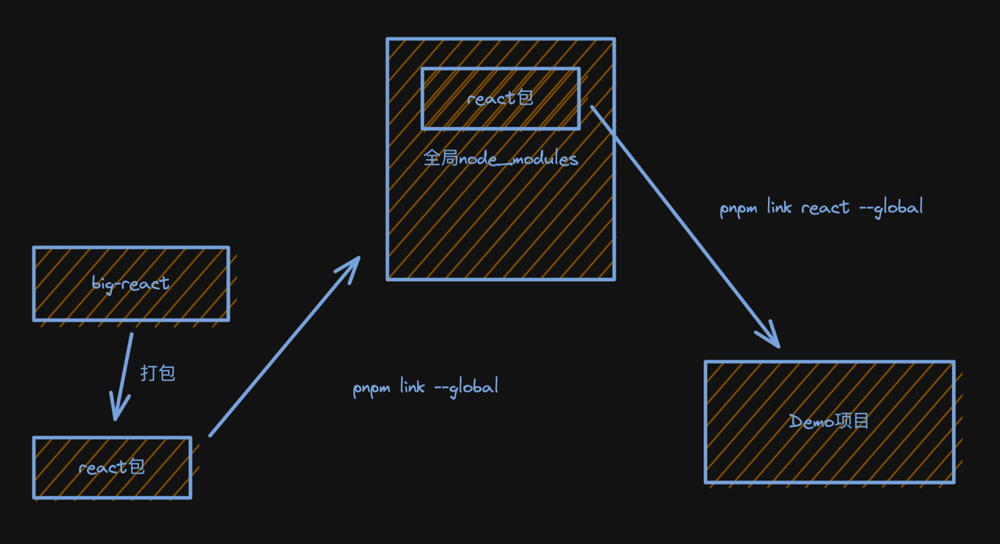

# big-react

## 项目搭建

### 1. 我们项目采用 Mono-repo 的形式：Mono-repo 可以很方便的协同管理不同独立的库的生命周期，相对应的，会有更高的操作复杂度。

### 2. 我们选择 pnpm 作为我们的打包工具

pnpm 初始化

```
npm install -g pnpm
pnpm init
```

初始化 pnpm-workspace.yaml(https://pnpm.io/zh/pnpm-workspace_yaml)

### 3. 定义开发规范

代码规范：lint 工具 eslint

```
pnpm i eslint -D -w  -D为开发依赖、-w安装在根目录

初始化：
npx eslint --init

选择了如下
√ How would you like to use ESLint? · problems
√ What type of modules does your project use? · esm
√ Which framework does your project use? · none
√ Does your project use TypeScript? · No / Yes
√ Where does your code run? · browser
√ What format do you want your config file to be in? · JSON
√ Would you like to install them now? · No / Yes
√ Which package manager do you want to use? · pnpm
```

上述安装后需要重新安装：pnpm i -D -w @typescript-eslint/eslint-plugin, @typescript-eslint/parser

最后会报 peer dependencies 的问题
ps: 既依赖又不需要安装的库作为你的 peer dependencies，因此 pnpm i -D -w typescript

安装 ts 的 eslint 的插件

```
pnpm i -D -w @typescript-eslint/eslint-plugin
```

### 4. 处理代码风格 prettier

```
pnpm i prettier -D -w
```

新建.prettierrc.json 配置文件，添加配置:

```
{
  "printWidth": 80,
  "tabWidth": 2,
  "useTabs": true,
  "singleQuote": true,
  "semi": true,
  "trailingComma": "none",
  "bracketSpacing": true
}
```

eslint 也会检查代码风格，为了不冲突，需要将 prettier 集成到 eslint 中，其中：

- eslint-config-prettier：覆盖 ESLint 本身的规则配置

- eslint-plugin-prettier：用 Prettier 来接管修复代码即 eslint --fix

```
pnpm i eslint-config-prettier eslint-plugin-prettier -D -w
```

为 lint 增加对应的执行脚本，并验证效果：

```
"lint": "eslint --ext .ts,.jsx,.tsx --fix --quiet ./packages"
```

### 5. commit 规范检查

安装 husky，用于拦截 commit 命令：

```
pnpm i husky -D -w
```

初始化 husky：

```
npx husky install
```

将刚才实现的格式化命令 pnpm lint 纳入 commit 时 husky 将执行的脚本：

```
npx husky add .husky/pre-commit "pnpm lint"
```

通过 commitlint 对 git 提交信息进行检查，首先安装必要的库：

```
pnpm i commitlint @commitlint/cli @commitlint/config-conventional -D -w
```

新建配置文件.commitlintrc.js：

```
module.exports = {
  extends: ["@commitlint/config-conventional"]
};
```

集成到 husky 中：

```
npx husky add .husky/commit-msg "npx --no-install commitlint -e $HUSKY_GIT_PARAMS"
```

conventional 规范集意义：

```
// 提交的类型: 摘要信息
<type>: <subject>
```

常用的 type 值包括如下:

- feat: 添加新功能
- fix: 修复 Bug
- chore: 一些不影响功能的更改
- docs: 专指文档的修改
- perf: 性能方面的优化
- refactor: 代码重构
- test: 添加一些测试代码等等

配置 tsconfig.json：

```
{
	"compileOnSave": true,
	"compilerOptions": {
		"target": "ESNext",
		"useDefineForClassFields": true,
		"module": "ESNext",
		"lib": ["ESNext", "DOM"],
		"moduleResolution": "Node",
		"strict": true,
		"sourceMap": true,
		"resolveJsonModule": true,
		"isolatedModules": true,
		"esModuleInterop": true,
		"noEmit": true,
		"noUnusedLocals": true,
		"noUnusedParameters": true,
		"noImplicitReturns": false,
		"skipLibCheck": true,
		"baseUrl": "./packages"
	}
}
```

### 6. 选择项目的打包工具

比较不同打包工具的区别 参考资料：Overview | Tooling.Report(https://bundlers.tooling.report/)我们要开发的项目的特点：

- 是库，而不是业务项目
- 希望工具尽可能简洁、打包产物可读性高
- 原生支持 ESM

所以选择 rollup，安装：

```
pnpm i -D -w rollup
```

## React 项目结构：

### 1. 项目结构

- react（宿主环境无关的公用方法）
- react-reconciler（协调器的实现，宿主环境无关）
- 各种宿主环境的包
- shared（公用辅助方法，宿主环境无关）

ps: react 等包里的 package.json

```
// main入口文件对应了commonjs规范，但是我们用rollup打包是原生支持ESModule的，因此module
// "main": "index.js",
// 在Mono-repo中我们的react引入了shared的包，将我们的shared定义为我们的react包的依赖
"dependencies": {
	"shared": "workspace:*"
},
```

编译时的 babel 将 jsx 帮我们转换成了 React.createElement

```
// react17之前
<div>123</div>
=> jsx转换
React.createElement("div", null, 123);

// react17之后
<div id="333">123</div>
=> jsx转换
import { jsx as _jsx } from "react/jsx-runtime";
/*#_PURE_*/ _jsx("div", {
	id: "333",
	children: "123"
});
```

### 2. 运行时，jsx 方法或者 React.createElement 方法的执行(包括 dev、prod 两个环境)，因此就需要实现这两个方法

编译时由 babel 编译实现，我们来实现运行时，工作量包括：

- 实现 jsx 方法
- 实现打包流程
- 实现调试打包结果的环境

### 3. 实现打包流程

对应上述两 3 方法，打包对应文件：

- react/jsx-dev-runtime.js（dev 环境）

-react/jsx-rumtime.js（prod 环境）

-React

我们的打包脚本都在 scripts 目录下。

打包流程中需要安装的 rollup plugin 与 node 包：

```
pnpm i -D -w rimraf rollup-plugin-generate-package-json rollup-plugin-typescript2 @rollup/plugin-commonjs
```

打包出来的 dist 目录里需要 package.json 文件，安装以下插件

```
pnpm i -D -w rollup-plugin-generate-package-json
```

### 4. 打包测试流程



#### 第一种调试方式--打包调试

这种方式的优点：可以模拟实际项目引用 React 的情况

缺点：对于我们当前开发 big-react 来说，略显繁琐。对于开发过程，更期望的是热更新效果。

```
// 第一步，全局node_modules下的react指向了当前的dist目录下的react包
cd dist/node_modules/react
pnpm link --global(报错的话 先pnpm setup，重启终端即可)

// 第二步，使用create-react-app创建新的目录
npx create-react-app react-demo
cd react-demo
pnpm link react --global(将项目中的react变为全局node_modules下的react)
```

#### 第二种调试方式--vite 实时调试

采用 vite 的实时调试，他的好处是「实时看到源码运行效果」。

创建 vite 项目：

```
// 在big-react根目录下执行
pnpm create vite

// 选择了如下
√ Project name: ... demos
√ Select a framework: » React
√ Select a variant: » TypeScript

cd demos
pnpm install
pnpm run dev
```

使用 vite 而不是 webpack 作为 demo 调试的原因：

1. 在开发阶段编译速度快于 webpack
2. vite 的插件体系与 rollup 兼容

```
big-react中package.json
// force每次重新编译我们的demo都会重新预编译，如果不配置，就会将依赖的react，react-dom缓存，达不到热更新的效果
"demo": "vite serve demos/test-fc --config scripts/vite/vite.config.js --force"

// vite的react中的配置在这里配置，然后再pnpm i
"typescript": "^4.9.4",
"@types/react": "^18.0.26",
"@types/react-dom": "^18.0.9",
"@vitejs/plugin-react": "^3.0.0",
"vite": "^4.0.0"
```

## 更新记录

2023/3/31
由于引入了 scheduler 包，导致调试的过程会出现串行，这里我们可以在调试的时候将浏览器的 sourcemap 功能关掉
